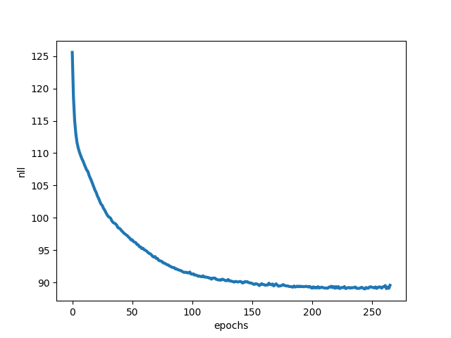
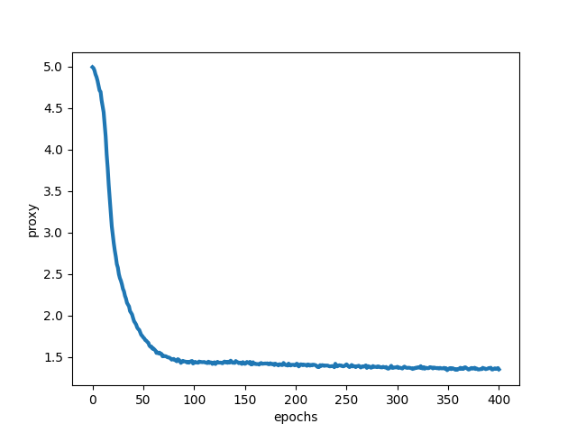

# Deep Generative Modeling

Here, I organize and list some important methods in the research field of Deep Generative Modeling.
We call it "Deep" just because when we need the artificial models to approach some underlying probability distribution (or unnormalized distribution), we usually use the parametric and trainable Deep Neural Networks to achieve it.

**Import Note**
In this repo., all source codes are almost referred to this [blog](https://jmtomczak.github.io/) and [github](https://github.com/jmtomczak/intro_dgm).
Actually, I am not one of participants of the project above. 
This is only a private practice for the educational and academic purposes and it's highly recommended that you can refer to the authors' [projects](https://jmtomczak.github.io/) to have a deeper dive in DGM.

---------------------------------------------------------------------------
## Research Venue in DGM

**Target of DGM**: 
Model the artificial disbribution $P_{\theta}(x)$, such that it approaches the diistribution we are intereseted in, *e.g.*, the real data-generating distribution $P^*(x)$ 

**Advantage**:
Once we achieve it, the first obvious advantage is that we can generate the deceptively realistic data by sampling from $P_{\theta}(x)$, which has shown the amaziing results recently (see Stable Diffusion).
The second one is, in the real system, when we need to make decisions (*e.g.*, a classification system), we can plug the input signal $x_i$ in $P_{\theta}(x)$ to get the additional information (probability) that how possible this $x_i$ occurs in the real world. 

This gives us another consideration that we may just reject this input because it seems to be "abnormal" to us. Otherwise, the classification model will just estimate the corresponding posterior probability $P_{\phi}(y|x_i)$ without considering the possibility of existence of $x_i$.
You can refer to the area of "Out-of-Distribution Detection (*aka* Anomaly Detection)", and one of methods in OOD Detection is to try to model the data distribution $P_{\theta}(x)$. 

**Difficulty**:

One of most well-known issues is about the normalization constant (*aka* the partition function), $Z$.
Consider the artificial disbribution modeled by us, $P_{\theta}(x) = \dfrac{f_{\theta}(x)}{Z_{\theta}}$, 
where $f_{\theta}(x)$ is non-negative everywhere and $Z_{\theta} = \int_{}^{} f_{\theta}(x) \,dx$ to make sure that $P_{\theta}(x)$ is well-normalized (*i.e.*, $\int_{}^{} P_{\theta}(x) \,dx$ = 1).

Next, if we want to use the concept of Maximum Likelihood Estimation (MLE), the following flow is:
*   given the collected real data $x_i$
    
    $\theta^* = \arg\max_\theta P_{\theta}(x_i) = \arg\max_\theta \ln{P_{\theta}(x_i)} = \arg\max_\theta \,(\ln{f_{\theta}(x_i)} - \ln{Z_{\theta}})$  

We will encounter a severe issue that we can't access the term $Z_\theta$.
In this case, $Z_{\theta}$ is a function of $\theta$ (irrelevant to the observed $x_i$) and calculated by integrating along the whole $x$ space. Here comes the difficulties that:
1. We can't analytically derive the form of integration of $f_{\theta}(x)$, since $f_{\theta}$ may be arbitrarily complicated (*e.g.* a DNN).
2. The $x$ space is a complex and high dimensional space, and we suffer from the infeasibility of computation.

**Method List:**

According to the difficulty mentioned above. The research community proposes many popular approches to address such issues. Although their details and the ways how they model the unknown distribution are different, they are equally important. We list them as follows:

**1. AutoRegressive Models (ARMs)**

<!--
This series of methods directly model the distribution in an autoregressive manner as:

$$P_{\theta}(\mathbf{x}) = P_\theta(x_0)\prod_{i=1}^{D}P_\theta(x_i|x_{<i})$$

where $\mathbf{x} = [x_0, x_1, ..., x_D]$ is the high-dimension input.

With this ARM manner, since it directly models the normalized probabiltiy, we don't bother to the partition function. However, we still need to carefully design the conditional distribution $P_\theta(x_i|x_{<i})$ and it may be computationally inefficient.
-->
**2. Flow-based Models**

**3. Latent Variable Models (VAEs and Diffusion-based Models)**

**4. Score-based Generative Models**

**5. Energy-based Models**

**6. Implicit Generative Models (GANs)**

By the way, recently there are some references ([arXiv link]((https://arxiv.org/abs/2208.11970))) trying to unify some of these methods and connect them in one perspective. FYI.

---------------------------------------------------------------------------
## Dependencies

* PyTorch
* torchvision
* scikit-learn
* numpy
* tqdm
* opencv-python
* imageio
* matplotlib

---------------------------------------------------------------------------
## Training DGMs and Results

Again, I must declare that these source codes are not written by me, please refer to [here](https://github.com/jmtomczak/intro_dgm) if you want a detailed illustration.

Note:
As illustrated in the author's blog, all the training codes use the small dataset in sklearn, Digits dataset.

| Real Image in Digits dataset (dimension is 8x8)| 
| ---------- |
| |

You can simply run the following scripts respectively to see the loss curve and the corresponding geneartion in the training process:

-----------------------------------------
**1. AutoRegressive Models**

`python autoregressive_model.py`

| Objective Loss Curve| Generation in training process |
| ---------- | ---------- |
| | |

-----------------------------------------
**2. Flow-based Models**

`python flow_based_model_realnvp.py`

| Objective Loss Curve| Generation in training process |
| ---------- | ---------- |
| | |

-----------------------------------------
**3. Energy-based Models**

`python energy_based_model.py`

| Objective Loss Curve| Generation in training process |
| ---------- | ---------- |
| | |

-----------------------------------------
**4. Score-based Generative Models - Score Matching**

`python score_matching.py`

| Objective Loss Curve| Generation in training process |
| ---------- | ---------- |
| | |

-----------------------------------------
**5. Score-based Generative Models - SBGM by SDE**

`python score_based_generative_model.py`

| Objective Loss Curve| Generation in training process |
| ---------- | ---------- |
| | |

-----------------------------------------
**6. Latent Variable Models - Diffusion-based Model (DDPM)**

`python score_based_generative_model.py`

| Objective Loss Curve| Generation in training process |
| ---------- | ---------- |
| | |

-----------------------------------------
As shown above, although the quality of image generations may not be very realistic, we still can see that the models gradually capture the underlying distribution $P_{\theta}(x)$ as the training stage progresses.
